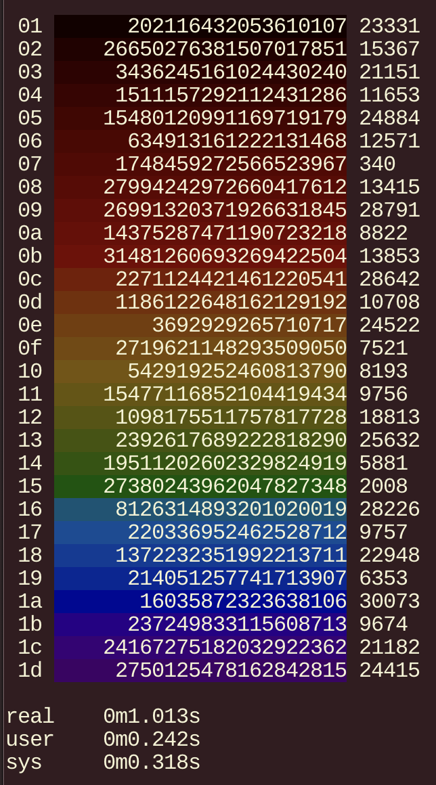

# Tint
Rust binary will use colors to indicate progress on output listings, faster then the included python version.

shell code use colors to indicate progress on output listings.

The program nm2rgb converts light wavelengths (approx 400nm to 800nm) into RGB colors for display.
In `fn.bash`, the `color_dark` function accepts a numerator (arg1), and denominator (arg2) of a number between
0 and 1 and converts it to terminal color control codes for a dimmed background indicating progress:

* red: beginning
* green: middle
* blue: end

If you have 150 items to list `color_dark $n 150` will set the nth tint of 150 color pallet.
Red has a longer wavelength than blue but the orientation is reversed for aesthetics. The
`color_dark` function also darkens the background colors to work well with light text.

Some shell script to generate this example is in `fn.bash` too.

A translation for the `color_dark` function could
make the colors useful, anytime you want to display progress while printing output...

Rust build examples
cargo build
cargo build --release

Swift build example from the tint dir (docker linux)
docker pull swift
docker run -it --rm -v $(pwd)/src:/src swift
swiftc ./src/*.swift -o ./tint
./tint -w 500